# Procesverslag
Markdown is een simpele manier om HTML te schrijven.  
Markdown cheat cheet: [Hulp bij het schrijven van Markdown](https://github.com/adam-p/markdown-here/wiki/Markdown-Cheatsheet).

Nb. De standaardstructuur en de spartaanse opmaak van de README.md zijn helemaal prima. Het gaat om de inhoud van je procesverslag. Besteedt de tijd voor pracht en praal aan je website.

Nb. Door *open* toe te voegen aan een *details* element kun je deze standaard open zetten. Fijn om dat steeds voor de relevante stuk(ken) te doen.

## Jij

  
uitwerken voor kick-off werkgroep

  ### Auteur:
  Aya Alnabelsi 

  #### Je startniveau:
 Tussen blauw en rood

  #### Je focus:
  Responsive 
 

## Je website

  
uitwerken voor kick-off werkgroep

  ### Je opdracht:
  https://www.starbucks.nl/nl 

  #### Screenshot(s) van de eerste pagina (small screen): 
  Homepage
  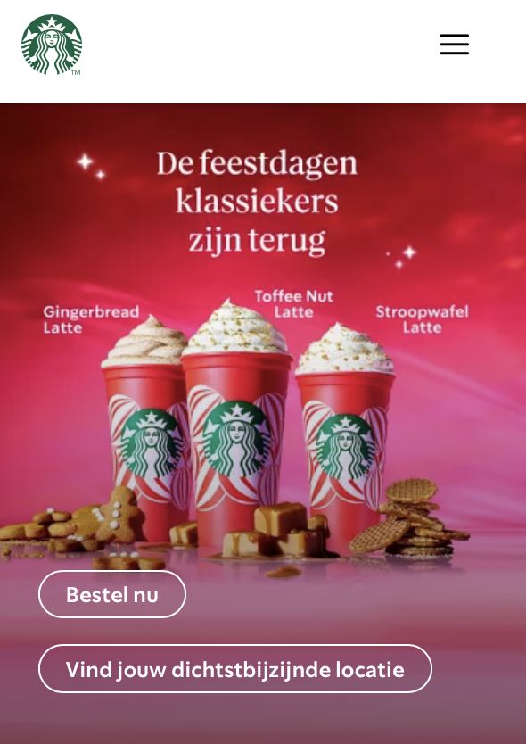

  #### Screenshot(s) van de tweede pagina (small screen):
  Studentenkorting 
  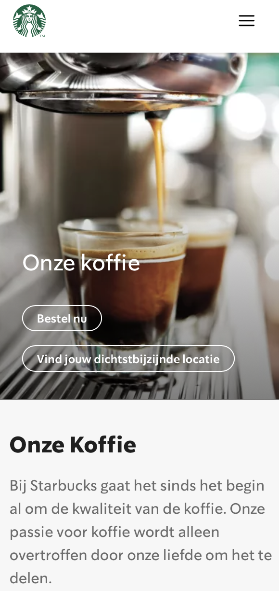
 

## Toegankelijkheidstest 1/2 (week 1)

  
uitwerken na test in 2e werkgroep

  ### Bevindingen
  Lijst met je bevindingen die in de test naar voren kwamen:

  Toegankelijkheid is een complexe en een belangrijke onderwerp binnen de design wereld, het is belangrijk om rekening te houden met alle doelgroepen inclusief mensen met dieverse beperkingen, zodat digitale content voor iedereen bruikbaar zijn. Een belangrijke aspect hiervan is de screenreader die slechtziende en blinden toegang biederen tot digitale content. Het werken met de screenreader was uitdagend, vooral omdat ik nog nooit erder met deze functionaliteit had gewerkt. Na veel uitproberen en onderzoeken is het mij gelukt om de verschillende highlights te bereiken via de knoppen command+option+control+ lin/re knop, Daarnaast heb ik geleerd hoe ik elementen in de rotor kan selecteren en hoe ik door de verschillende onderdelen kan navigeren.  

WCAG checklist
  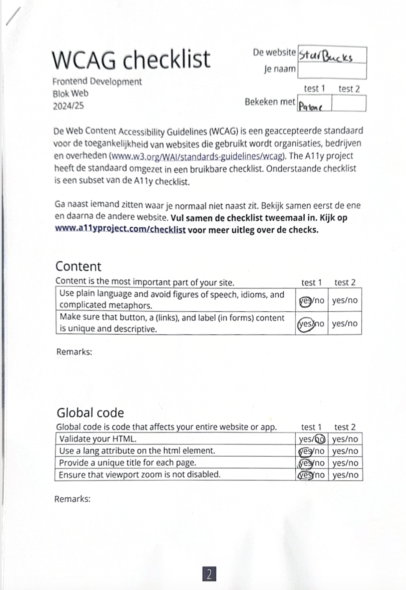
  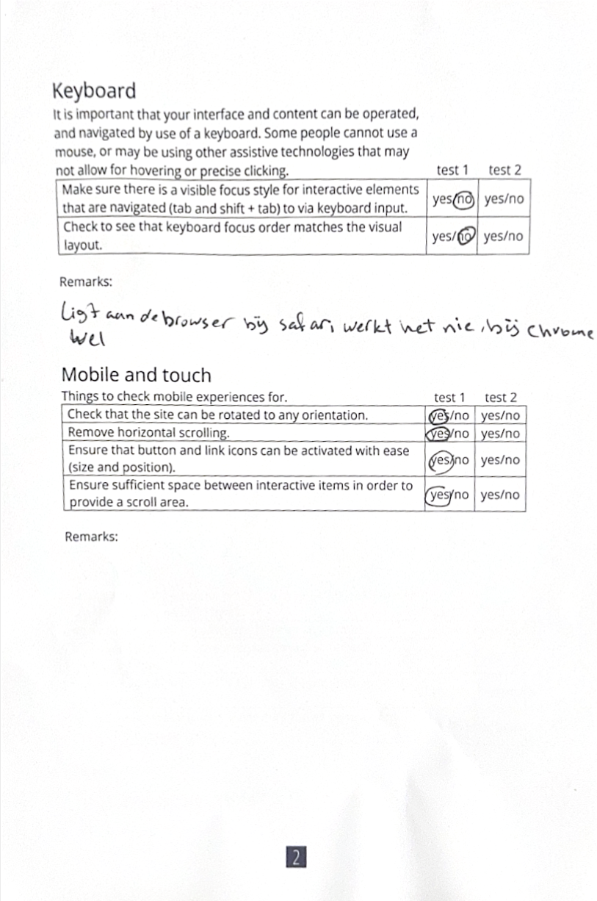
  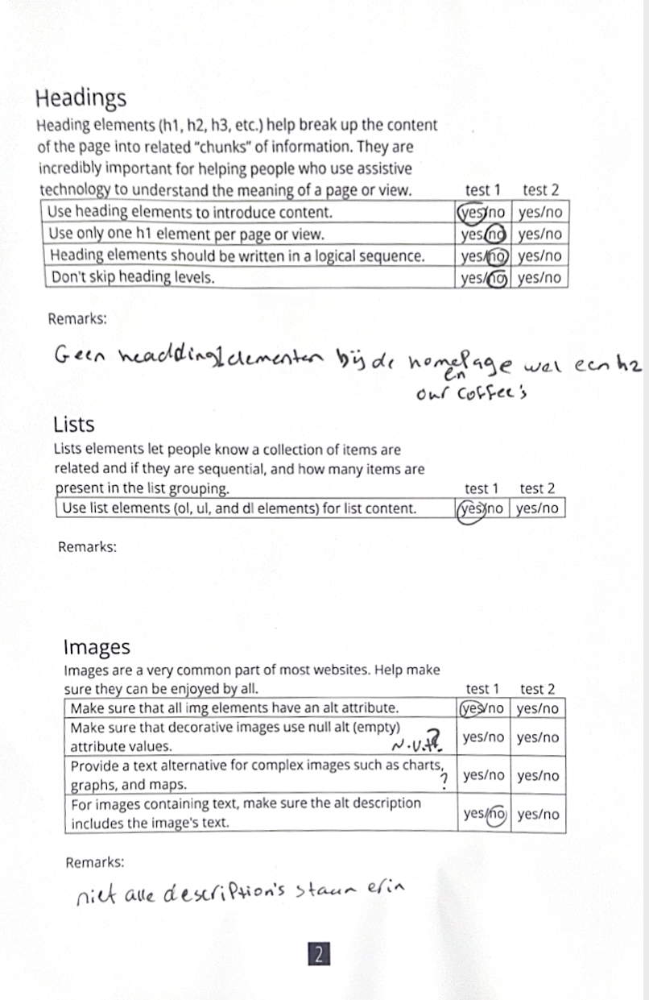
  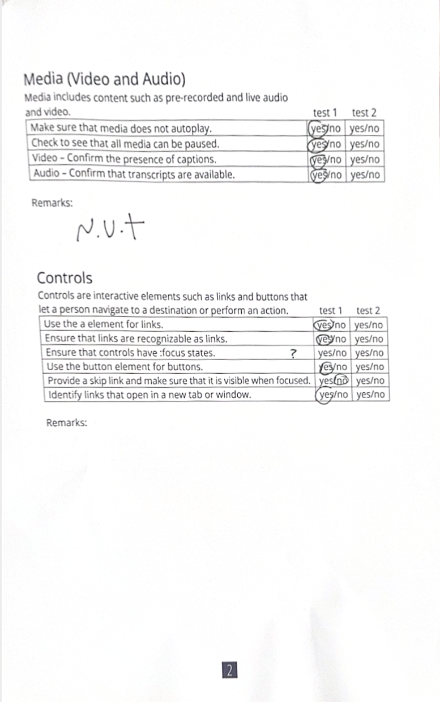
  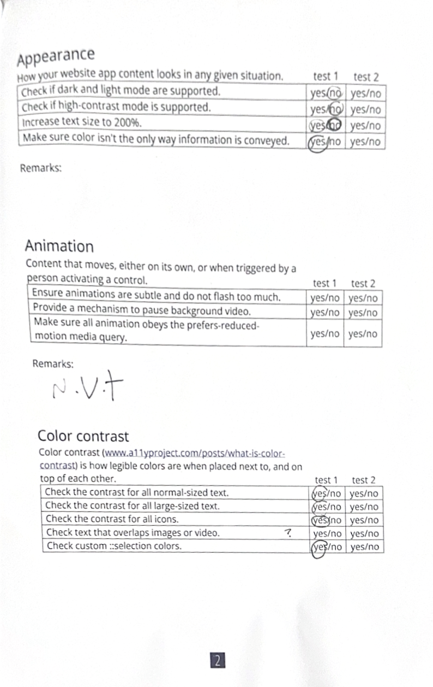

## Breakdownschets (week 1)

  
uitwerken na afloop 3e werkgroep

  ### de hele pagina: 
  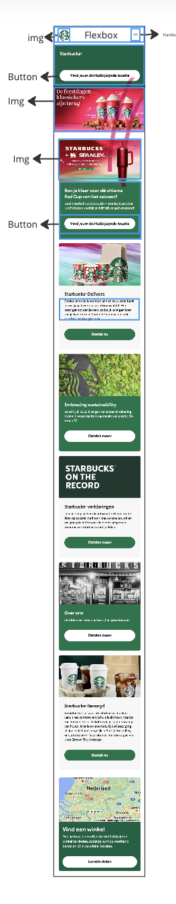

  ### dynamisch deel (bijv menu): 
  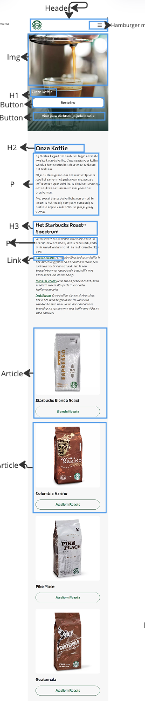

  ### wellicht nog een dynamisch deel (bijv filter): 
  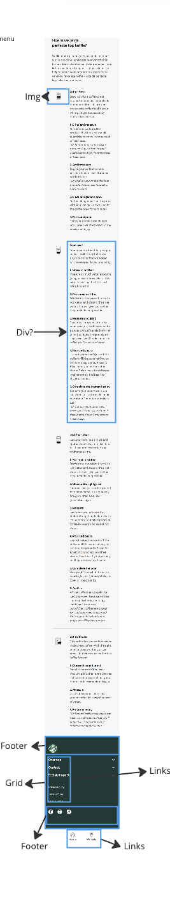

## Voortgang 1 (week 2)

  
uitwerken voor 1e voortgang

  ### Stand van zaken
  hier dit ging goed & dit was lastig (neem ook screenshots op van delen van je website en code)

  ### Agenda voor meeting
  samen met je groepje opstellen

  | student 1  Aya |student 2 Patoune   |student3 Nasima 
  | Homepage Html  |Homepage starbucks  Html bespreken 
  | bespreken             

  ### Verslag van meeting
  hier na afloop snel de uitkomsten van de meeting vastleggen
  Ontvangen feedback:
  
  1- Kijken hoe ik mijn header navigatie ga fixen 
  2- Kijken hoe ik een mobile menu en desktop menu ga maken. 
  3- lijst maken voor de linkjes naar andere pagina's
  4- List items in de details niet vergeten te sluiten 
  5- Voor google maps blokje i-frame google maps gebruiken 
  6- voor icoontjes betern svg's gebruiken 

## Voortgang 2 (week 3)

  
uitwerken voor 2e voortgang

  ### Stand van zaken
  hier dit ging goed & dit was lastig (neem ook screenshots op van delen van je website en code)

  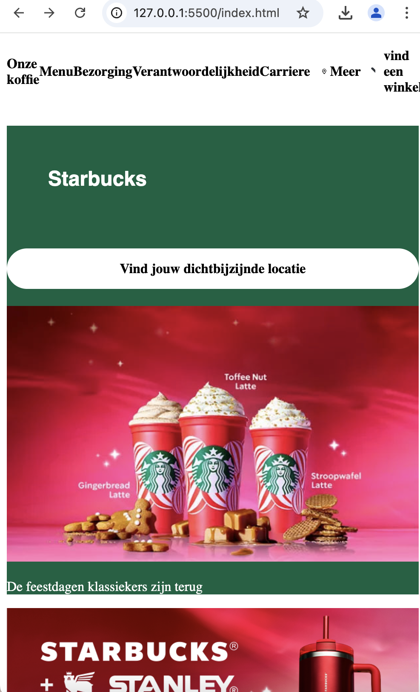
  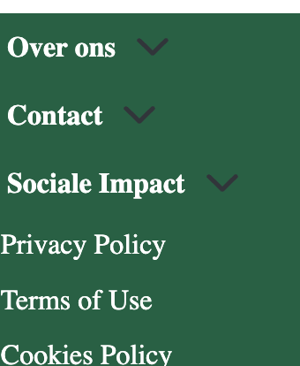

  Wat ik nog lastig vind is het fixen van de images en de groene background color en hoe ik dat helemaal onder elkaar ga krijgen.
  Verder wil ik nog uitproberen hoe ik de pijltjes aan de re kant kan zetten met behulp van grid.

 

  ### Agenda voor meeting
  samen met je groepje opstellen

  | student 1 Aya  
  Ik wil uitleg over
  hoe ik grid het beste
  kan toepassen voor de
  verschillende achter-
  gronden

  ### Verslag van meeting
  hier na afloop snel de uitkomsten van de meeting vastleggen

  - Code goed ordenen, uiteindelijk heb ik  3 stylescheet nodig in css
  

## Toegankelijkheidstest 2/2 (week 4)

  
uitwerken na test in 9e werkgroep

  ### Bevindingen
  Lijst met je bevindingen die in de test naar voren kwamen (geef ook aan wat er verbeterd is):

- Gebruikt duidelijke taal
- Inhoud van knoppen bestaat uit een a. href
- Elke pagina heeft een titel, h1, h2, h3
- Er komt een focus stijl om tekst heen en gaat in goede volgorde
- De website kan in elke gewenste richting omgedrijt worden
- Er is genoeg ruimte tussen elementen, er wordt 1 h1 per pagina gebruikt
- Er wordt gebruik gemaakt van lijstelementen ul, li, 
- Images hebben een alt attribuut
- Er wordt een a element voor link gebruikt

## Voortgang 3 (week 4)

  
uitwerken voor 3e voortgang

  ### Stand van zaken
  hier dit ging goed & dit was lastig (neem ook screenshots op van delen van je website en code)

  ### Agenda voor meeting
  samen met je groepje opstellen

  | student 1 Aya              | student 2 Patoune         

  |image in de footer           Hamburgermenu 
  werkt niet mee, en nav
  lukt niet helemaal         

  ### Verslag van meeting
  hier na afloop snel de uitkomsten van de meeting vastleggen

  - Oefen met @media om je website responsieve te maken
  - footer summary::after regel 360 het linkje daar laten staan wordt lastig met stijling als je t in html zet

  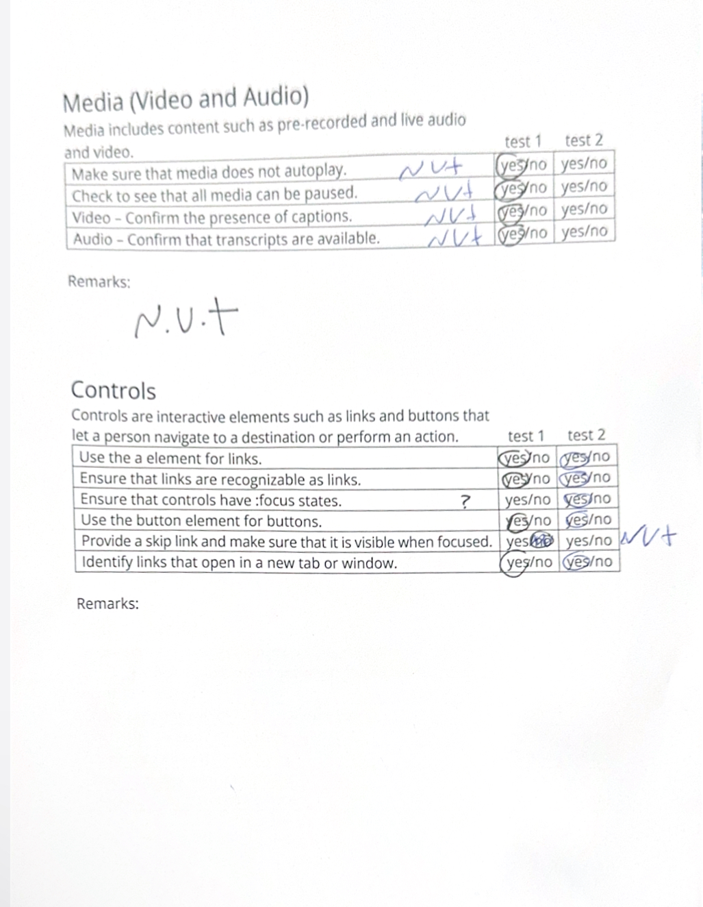
   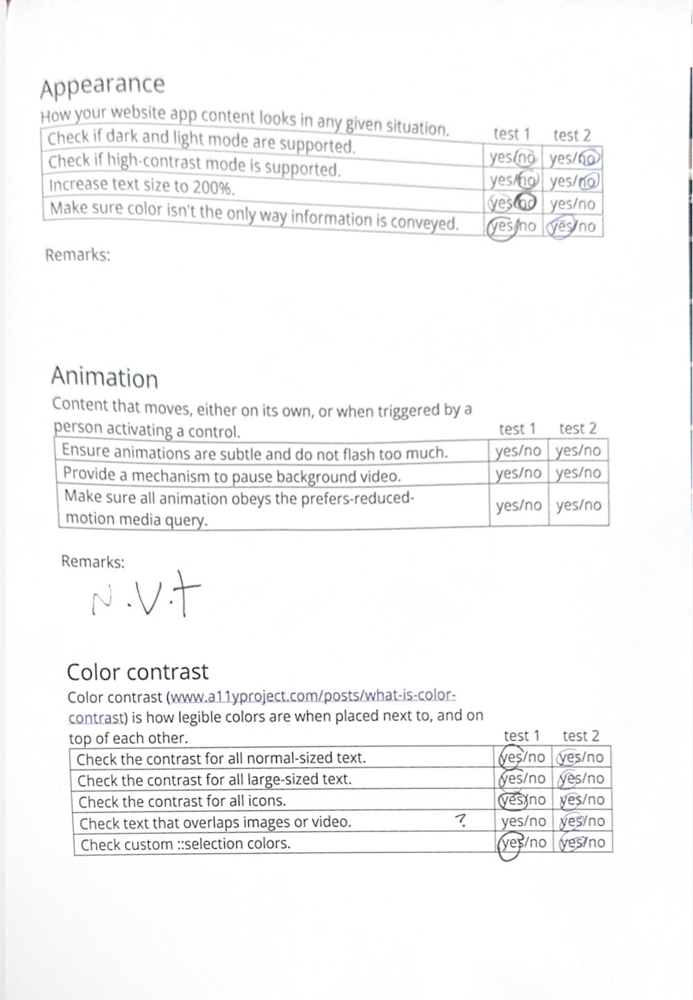
     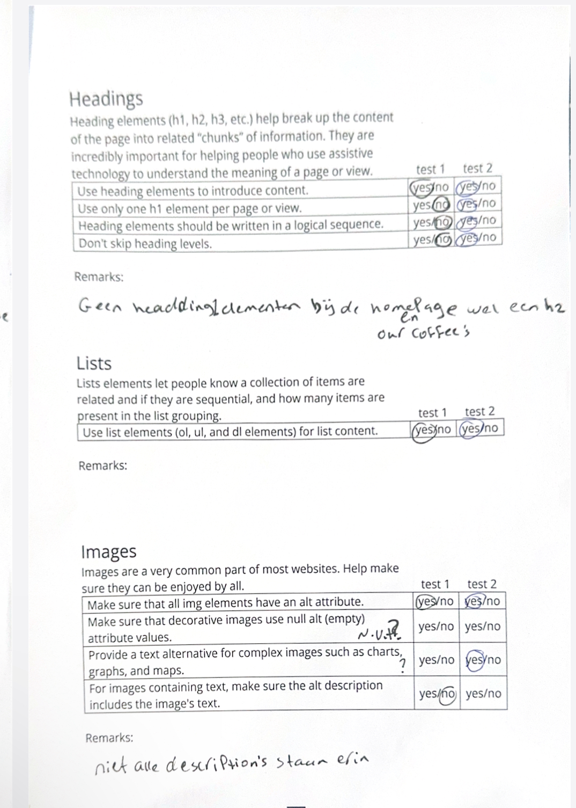
       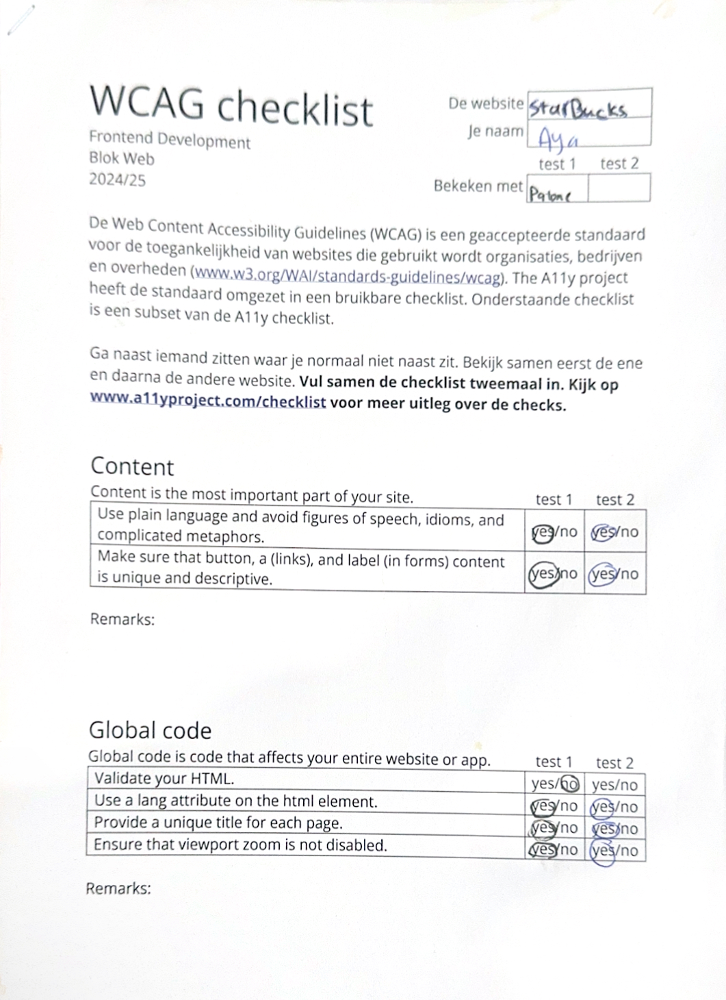
        

## Eindgesprek (week 5)

  
uitwerken voor eindgesprek

  ### Je uitkomst - karakteristiek screenshots:
  

  ### Dit ging goed/Heb ik geleerd: 
 - ik heb geleerd hoe ik zo'n footer kan maken met behulp van details en summary
 - ik heb geleerd hoe ik een witte background kan crieeren achter een img
 - ik heb veel geleerd over details, artickels en summary 

   
   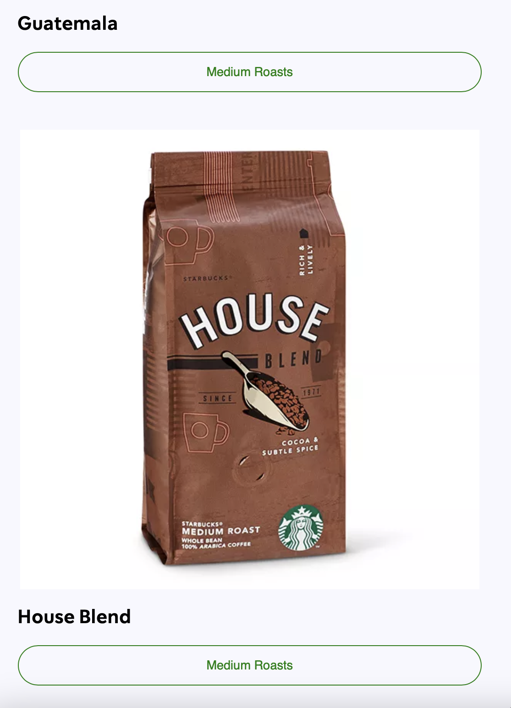
   
  

  ### Dit was lastig/Is niet gelukt:
  Korte omschrijving met plaatjes

Ik vond dit stukje vooral het moeilijkst, het was ingewikkeld om het te stijlen net als de orginele website, dankzij de hulp van de studentassistent is het mij gelukt om deze voor elkaar te krijgen. 

  

## Bronnenlijst

  
continu bijhouden terwijl je werkt

1.  <!--https://developer.mozilla.org/en-US/docs/Web/CSS/vertical-align--> 
2. <!--https://developer.mozilla.org/en-US/docs/Web/CSS/text-transform-->
3. <!-- https://developer.mozilla.org/en-US/docs/Web/CSS/filter-function/invert -->
4. <!-- https://codepen.io/SitePoint/pen/gOqYGPZ -->
5. <!--https://www.svgrepo.com/svg/473799/starbucks?edit=true-->
6. <!--https://www.svgrepo.com/svg/532540/location-pin-alt-1?edit=true-->
7. <!-- https://www.svgrepo.com/svg/453655/world-->
8. <!--https://developer.mozilla.org/en-US/docs/Web/HTML/Element/br-->
9. <!--https://developer.mozilla.org/en-US/docs/Web/HTML/Element/article-->
10.<!--https://www.maps.ie/create-google-map-->
11.<!--https://www.svgrepo.com/svg/473799/starbucks?edit=true-->
12.<!--https://developer.mozilla.org/en-US/docs/Web/HTML/Element/details*/-->
13.<!-- https://developer.mozilla.org/en-US/docs/Web/SVG/Attribute/target -->
14.<!--https://www.svgrepo.com/svg/499947/front-page?edit=true-->
15.  <!--https://www.svgrepo.com/svg/532539/location-pin-->
16.  <!--https://www.svgrepo.com/svg/473799/starbucks?edit=true-->
17.  <!--https://www.svgrepo.com/svg/532540/location-pin-alt-1?edit=true-->
18.  <!-- https://www.svgrepo.com/svg/453655/world-->
19.  <!--https://www.svgrepo.com/svg/473799/starbucks?edit=true-->
20.  <!--https://developer.mozilla.org/en-US/docs/Web/HTML/Element/details*/-->
21.  <!-- https://developer.mozilla.org/en-US/docs/Web/SVG/Attribute/target -->
22. <!--https://www.svgrepo.com/svg/499947/front-page?edit=true-->
23. <!--https://www.svgrepo.com/svg/532539/location-pin-->

